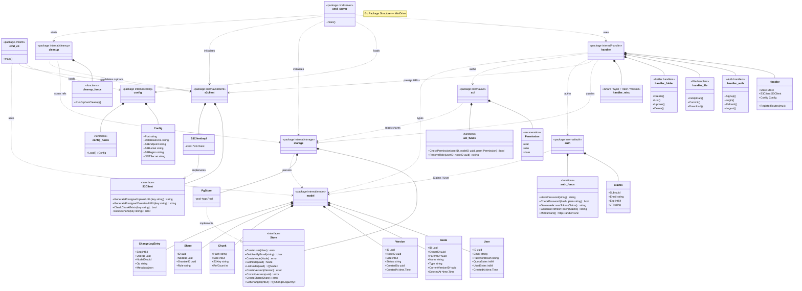

# Task 10 — Class Diagram: Go Package Structure — MiniDrive

```mermaid
classDiagram
    direction TB

    note "Go Package Structure — MiniDrive"

    %% ─── Entry Points ───

    class cmd_server {
        <<package cmd/server>>
        +main()
    }

    class cmd_cli {
        <<package cmd/cli>>
        +main()
    }

    %% ─── Configuration ───

    class config {
        <<package internal/config>>
    }
    class Config {
        +Port string
        +DatabaseURL string
        +S3Endpoint string
        +S3Bucket string
        +S3Region string
        +JWTSecret string
    }
    class config_funcs {
        <<functions>>
        +Load() Config
    }
    config *-- Config
    config *-- config_funcs

    %% ─── Domain Models ───

    class model {
        <<package internal/model>>
    }
    class User {
        +ID uuid
        +Email string
        +PasswordHash string
        +QuotaBytes int64
        +UsedBytes int64
        +CreatedAt time.Time
    }
    class Node {
        +ID uuid
        +OwnerID uuid
        +ParentID *uuid
        +Name string
        +Type string
        +CurrentVersionID *uuid
        +DeletedAt *time.Time
    }
    class Version {
        +ID uuid
        +NodeID uuid
        +Size int64
        +Status string
        +CreatedBy uuid
        +CreatedAt time.Time
    }
    class Chunk {
        +Hash string
        +Size int64
        +S3Key string
        +RefCount int
    }
    class Share {
        +ID uuid
        +NodeID uuid
        +GranteeID uuid
        +Role string
    }
    class ChangeLogEntry {
        +Seq int64
        +UserID uuid
        +NodeID uuid
        +Op string
        +Metadata json
    }
    model *-- User
    model *-- Node
    model *-- Version
    model *-- Chunk
    model *-- Share
    model *-- ChangeLogEntry

    %% ─── Storage Layer ───

    class storage {
        <<package internal/storage>>
    }
    class Store {
        <<interface>>
        +CreateUser(User) error
        +GetUserByEmail(string) User
        +CreateNode(Node) error
        +GetNode(uuid) Node
        +ListFolder(uuid) ~[]Node~
        +CreateVersion(Version) error
        +CommitVersion(uuid) error
        +CreateShare(Share) error
        +GetChanges(int64) ~[]ChangeLogEntry~
        %%~ additional CRUD methods…
    }
    class PgStore {
        -pool *pgx.Pool
    }
    PgStore ..|> Store : implements
    storage *-- Store
    storage *-- PgStore

    %% ─── S3 Client Layer ───

    class s3client {
        <<package internal/s3client>>
    }
    class S3Client {
        <<interface>>
        +GeneratePresignedUploadURL(key string) string
        +GeneratePresignedDownloadURL(key string) string
        +CheckChunkExists(key string) bool
        +DeleteChunk(key string) error
    }
    class S3ClientImpl {
        -client *s3.Client
    }
    S3ClientImpl ..|> S3Client : implements
    s3client *-- S3Client
    s3client *-- S3ClientImpl

    %% ─── Auth ───

    class auth {
        <<package internal/auth>>
    }
    class Claims {
        +Sub uuid
        +Email string
        +Exp int64
        +JTI string
    }
    class auth_funcs {
        <<functions>>
        +HashPassword(string) string
        +CheckPassword(hash, plain string) bool
        +GenerateAccessToken(Claims) string
        +GenerateRefreshToken(Claims) string
        +Middleware() http.HandlerFunc
    }
    auth *-- Claims
    auth *-- auth_funcs

    %% ─── ACL ───

    class acl {
        <<package internal/acl>>
    }
    class Permission {
        <<enumeration>>
        read
        write
        share
    }
    class acl_funcs {
        <<functions>>
        +CheckPermission(userID, nodeID uuid, perm Permission) bool
        +ResolveRole(userID, nodeID uuid) string
    }
    acl *-- Permission
    acl *-- acl_funcs

    %% ─── HTTP Handler ───

    class handler {
        <<package internal/handler>>
    }
    class Handler {
        +Store Store
        +S3Client S3Client
        +Config Config
        +RegisterRoutes(mux)
    }
    class handler_auth {
        <<Auth handlers>>
        +Signup()
        +Login()
        +Refresh()
        +Logout()
    }
    class handler_file {
        <<File handlers>>
        +InitUpload()
        +Commit()
        +Download()
    }
    class handler_folder {
        <<Folder handlers>>
        +Create()
        +List()
        +Update()
        +Delete()
    }
    class handler_misc {
        <<Share / Sync / Trash / Version>>
        %%~ grouped handlers
    }
    handler *-- Handler
    handler *-- handler_auth
    handler *-- handler_file
    handler *-- handler_folder
    handler *-- handler_misc

    %% ─── Cleanup ───

    class cleanup {
        <<package internal/cleanup>>
    }
    class cleanup_funcs {
        <<functions>>
        +RunOrphanCleanup()
    }
    cleanup *-- cleanup_funcs

    %% ═══════════════════════════════════
    %% Dependencies
    %% ═══════════════════════════════════

    cmd_server ..> handler : uses
    cmd_server ..> config : loads
    cmd_server ..> storage : initialises
    cmd_server ..> s3client : initialises
    cmd_server ..> cleanup : starts

    cmd_cli ..> config : loads
    cmd_cli ..> s3client : uses
    cmd_cli ..> model : uses

    handler ..> storage : queries
    handler ..> s3client : presign URLs
    handler ..> auth : authn
    handler ..> acl : authz
    handler ..> model : types

    storage ..> model : persists
    acl ..> storage : reads shares
    cleanup ..> storage : scans refs
    cleanup ..> s3client : deletes orphans
    auth ..> model : Claims / User
```
