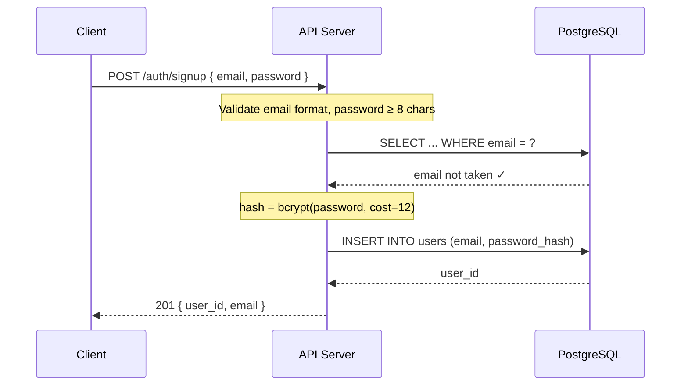
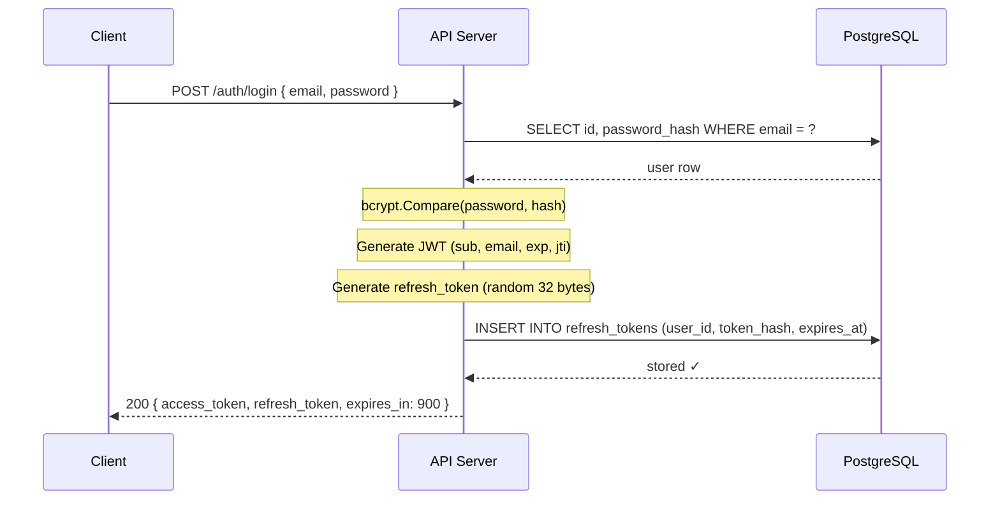
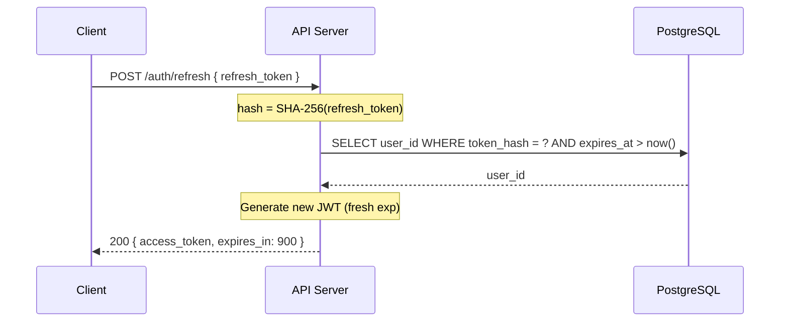

# Auth Flow — Sequence Diagrams

## Signup

```mermaid
sequenceDiagram
    participant C as Client
    participant A as API Server
    participant P as PostgreSQL

    C->>A: POST /auth/signup { email, password }
    Note over A: Validate email format, password ≥ 8 chars

    A->>P: SELECT ... WHERE email = ?
    P-->>A: email not taken ✓

    Note over A: hash = bcrypt(password, cost=12)

    A->>P: INSERT INTO users (email, password_hash)
    P-->>A: user_id

    A-->>C: 201 { user_id, email }
```

## Login

```mermaid
sequenceDiagram
    participant C as Client
    participant A as API Server
    participant P as PostgreSQL

    C->>A: POST /auth/login { email, password }

    A->>P: SELECT id, password_hash WHERE email = ?
    P-->>A: user row

    Note over A: bcrypt.Compare(password, hash)
    Note over A: Generate JWT (sub, email, exp, jti)
    Note over A: Generate refresh_token (random 32 bytes)

    A->>P: INSERT INTO refresh_tokens (user_id, token_hash, expires_at)
    P-->>A: stored ✓

    A-->>C: 200 { access_token, refresh_token, expires_in: 900 }
```

## Token Refresh

```mermaid
sequenceDiagram
    participant C as Client
    participant A as API Server
    participant P as PostgreSQL

    C->>A: POST /auth/refresh { refresh_token }

    Note over A: hash = SHA-256(refresh_token)

    A->>P: SELECT user_id WHERE token_hash = ? AND expires_at > now()
    P-->>A: user_id

    Note over A: Generate new JWT (fresh exp)

    A-->>C: 200 { access_token, expires_in: 900 }
```
