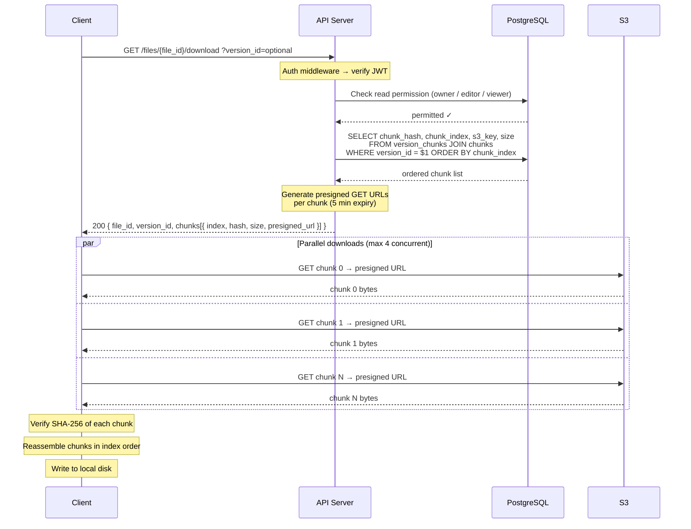
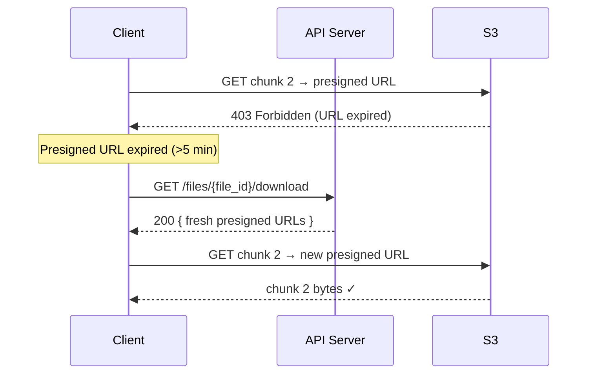

# Download — Sequence Diagram

## Full Download Flow

```mermaid
sequenceDiagram
    participant C as Client
    participant A as API Server
    participant P as PostgreSQL
    participant S as S3

    C->>A: GET /files/{file_id}/download ?version_id=optional

    Note over A: Auth middleware → verify JWT

    A->>P: Check read permission (owner / editor / viewer)
    P-->>A: permitted ✓

    A->>P: SELECT chunk_hash, chunk_index, s3_key, size<br/>FROM version_chunks JOIN chunks<br/>WHERE version_id = $1 ORDER BY chunk_index
    P-->>A: ordered chunk list

    Note over A: Generate presigned GET URLs<br/>per chunk (5 min expiry)

    A-->>C: 200 { file_id, version_id, chunks[{ index, hash, size, presigned_url }] }

    par Parallel downloads (max 4 concurrent)
        C->>S: GET chunk 0 → presigned URL
        S-->>C: chunk 0 bytes
    and
        C->>S: GET chunk 1 → presigned URL
        S-->>C: chunk 1 bytes
    and
        C->>S: GET chunk N → presigned URL
        S-->>C: chunk N bytes
    end

    Note over C: Verify SHA-256 of each chunk
    Note over C: Reassemble chunks in index order
    Note over C: Write to local disk
```

## Download — Presigned URL Expired

```mermaid
sequenceDiagram
    participant C as Client
    participant A as API Server
    participant S as S3

    C->>S: GET chunk 2 → presigned URL
    S-->>C: 403 Forbidden (URL expired)

    Note over C: Presigned URL expired (>5 min)

    C->>A: GET /files/{file_id}/download
    A-->>C: 200 { fresh presigned URLs }

    C->>S: GET chunk 2 → new presigned URL
    S-->>C: chunk 2 bytes ✓
```
