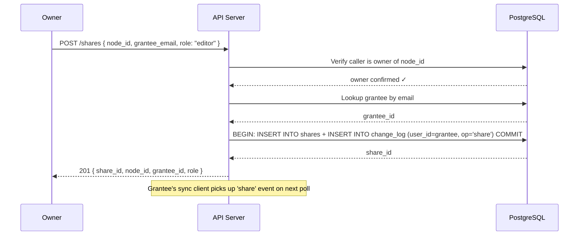
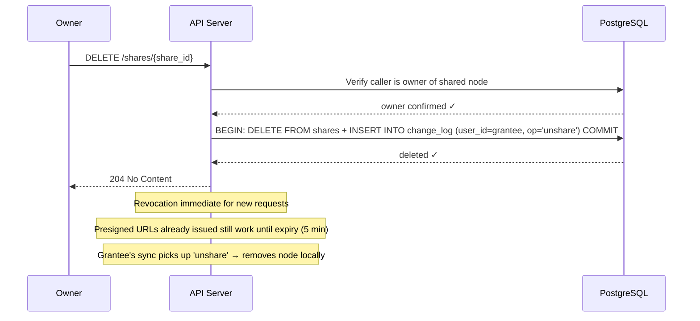

# Share Grant & Revoke — Sequence Diagrams

## 1. Grant Access

```mermaid
sequenceDiagram
    participant O as Owner
    participant A as API Server
    participant P as PostgreSQL

    O->>A: POST /shares { node_id, grantee_email, role: "editor" }
    A->>P: Verify caller is owner of node_id
    P-->>A: owner confirmed ✓
    A->>P: Lookup grantee by email
    P-->>A: grantee_id
    A->>P: BEGIN: INSERT INTO shares + INSERT INTO change_log (user_id=grantee, op='share') COMMIT
    P-->>A: share_id
    A-->>O: 201 { share_id, node_id, grantee_id, role }
    Note over A: Grantee's sync client picks up 'share' event on next poll
```

## 2. Revoke Access

```mermaid
sequenceDiagram
    participant O as Owner
    participant A as API Server
    participant P as PostgreSQL

    O->>A: DELETE /shares/{share_id}
    A->>P: Verify caller is owner of shared node
    P-->>A: owner confirmed ✓
    A->>P: BEGIN: DELETE FROM shares + INSERT INTO change_log (user_id=grantee, op='unshare') COMMIT
    P-->>A: deleted ✓
    A-->>O: 204 No Content
    Note over A: Revocation immediate for new requests
    Note over A: Presigned URLs already issued still work until expiry (5 min)
    Note over A: Grantee's sync picks up 'unshare' → removes node locally
```
