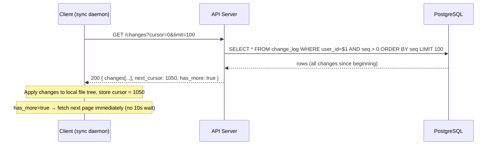
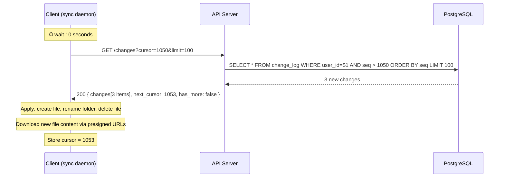
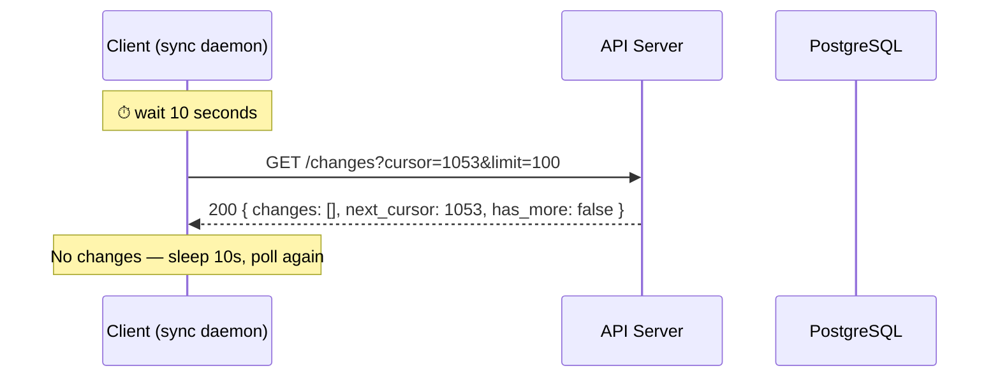

# Sync Polling — Sequence Diagrams

## 1. Initial Sync (cursor=0)

```mermaid
sequenceDiagram
    participant C as Client (sync daemon)
    participant A as API Server
    participant P as PostgreSQL

    C->>A: GET /changes?cursor=0&limit=100
    A->>P: SELECT * FROM change_log WHERE user_id=$1 AND seq > 0 ORDER BY seq LIMIT 100
    P-->>A: rows (all changes since beginning)
    A-->>C: 200 { changes[...], next_cursor: 1050, has_more: true }
    Note over C: Apply changes to local file tree, store cursor = 1050
    Note over C: has_more=true → fetch next page immediately (no 10s wait)
```

## 2. Steady State (every 10 seconds)

```mermaid
sequenceDiagram
    participant C as Client (sync daemon)
    participant A as API Server
    participant P as PostgreSQL

    Note over C: ⏱ wait 10 seconds
    C->>A: GET /changes?cursor=1050&limit=100
    A->>P: SELECT * FROM change_log WHERE user_id=$1 AND seq > 1050 ORDER BY seq LIMIT 100
    P-->>A: 3 new changes
    A-->>C: 200 { changes[3 items], next_cursor: 1053, has_more: false }
    Note over C: Apply: create file, rename folder, delete file
    Note over C: Download new file content via presigned URLs
    Note over C: Store cursor = 1053
```

## 3. No Changes (common case)

```mermaid
sequenceDiagram
    participant C as Client (sync daemon)
    participant A as API Server
    participant P as PostgreSQL

    Note over C: ⏱ wait 10 seconds
    C->>A: GET /changes?cursor=1053&limit=100
    A-->>C: 200 { changes: [], next_cursor: 1053, has_more: false }
    Note over C: No changes — sleep 10s, poll again
```
