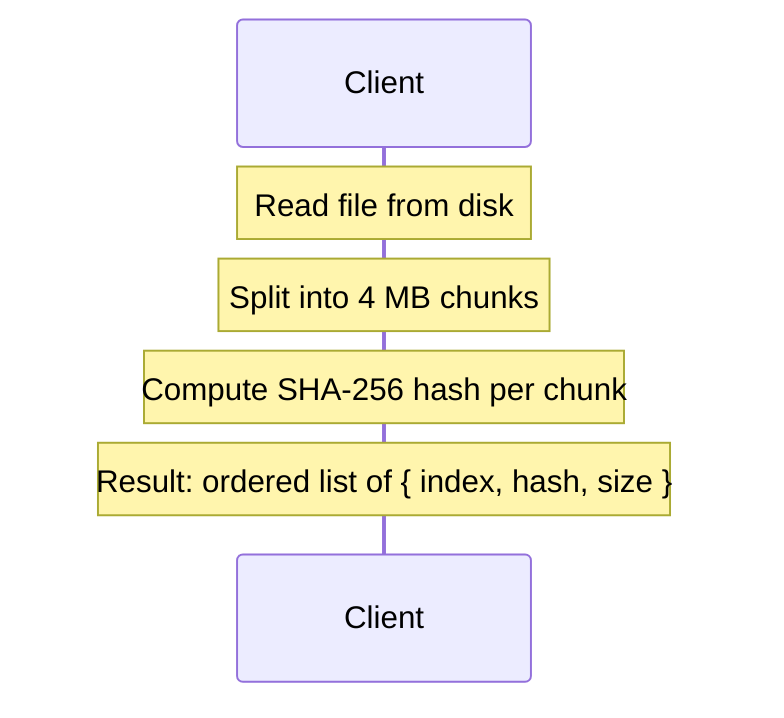
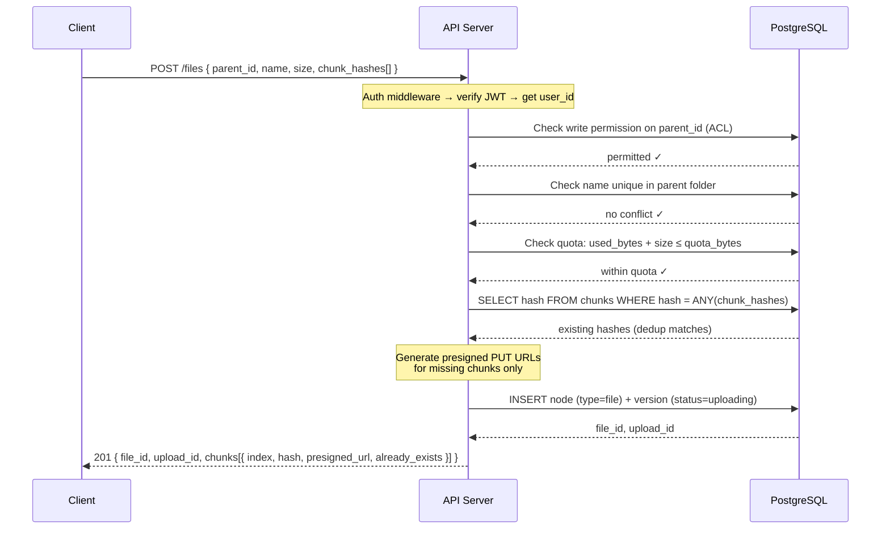
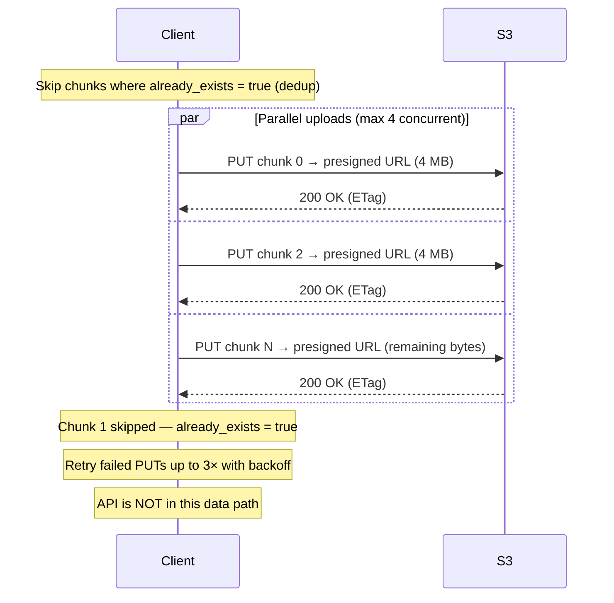
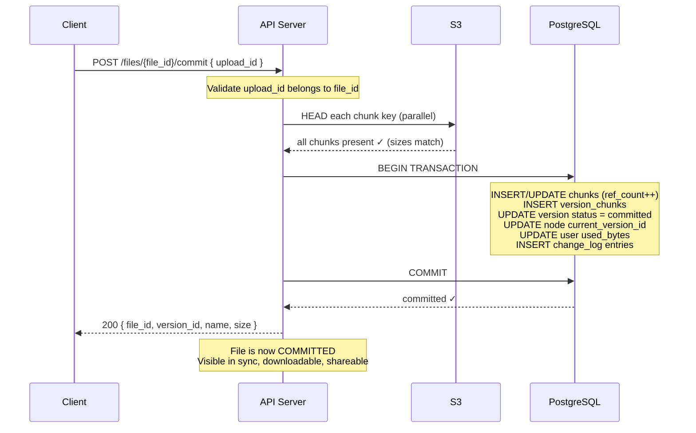
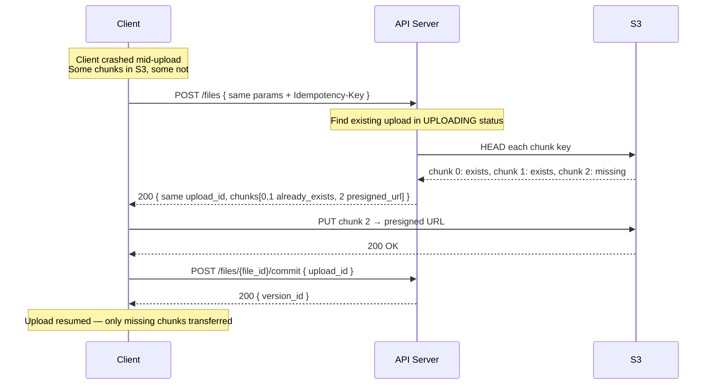

# Chunked Upload — Sequence Diagrams

## Phase 1: Client Prep

```mermaid
sequenceDiagram
    participant C as Client

    Note over C: Read file from disk
    Note over C: Split into 4 MB chunks
    Note over C: Compute SHA-256 hash per chunk
    Note over C: Result: ordered list of { index, hash, size }
```

## Phase 2: Init Upload

```mermaid
sequenceDiagram
    participant C as Client
    participant A as API Server
    participant P as PostgreSQL

    C->>A: POST /files { parent_id, name, size, chunk_hashes[] }

    Note over A: Auth middleware → verify JWT → get user_id

    A->>P: Check write permission on parent_id (ACL)
    P-->>A: permitted ✓

    A->>P: Check name unique in parent folder
    P-->>A: no conflict ✓

    A->>P: Check quota: used_bytes + size ≤ quota_bytes
    P-->>A: within quota ✓

    A->>P: SELECT hash FROM chunks WHERE hash = ANY(chunk_hashes)
    P-->>A: existing hashes (dedup matches)

    Note over A: Generate presigned PUT URLs<br/>for missing chunks only

    A->>P: INSERT node (type=file) + version (status=uploading)
    P-->>A: file_id, upload_id

    A-->>C: 201 { file_id, upload_id, chunks[{ index, hash, presigned_url, already_exists }] }
```

## Phase 3: Chunk Transfer (direct to S3)

```mermaid
sequenceDiagram
    participant C as Client
    participant S as S3

    Note over C: Skip chunks where already_exists = true (dedup)

    par Parallel uploads (max 4 concurrent)
        C->>S: PUT chunk 0 → presigned URL (4 MB)
        S-->>C: 200 OK (ETag)
    and
        C->>S: PUT chunk 2 → presigned URL (4 MB)
        S-->>C: 200 OK (ETag)
    and
        C->>S: PUT chunk N → presigned URL (remaining bytes)
        S-->>C: 200 OK (ETag)
    end

    Note over C: Chunk 1 skipped — already_exists = true
    Note over C: Retry failed PUTs up to 3× with backoff
    Note over C: API is NOT in this data path
```

## Phase 4: Commit

```mermaid
sequenceDiagram
    participant C as Client
    participant A as API Server
    participant S as S3
    participant P as PostgreSQL

    C->>A: POST /files/{file_id}/commit { upload_id }

    Note over A: Validate upload_id belongs to file_id

    A->>S: HEAD each chunk key (parallel)
    S-->>A: all chunks present ✓ (sizes match)

    A->>P: BEGIN TRANSACTION
    Note over P: INSERT/UPDATE chunks (ref_count++)<br/>INSERT version_chunks<br/>UPDATE version status = committed<br/>UPDATE node current_version_id<br/>UPDATE user used_bytes<br/>INSERT change_log entries
    A->>P: COMMIT
    P-->>A: committed ✓

    A-->>C: 200 { file_id, version_id, name, size }

    Note over A: File is now COMMITTED<br/>Visible in sync, downloadable, shareable
```

## Resume After Crash

```mermaid
sequenceDiagram
    participant C as Client
    participant A as API Server
    participant S as S3

    Note over C: Client crashed mid-upload<br/>Some chunks in S3, some not

    C->>A: POST /files { same params + Idempotency-Key }

    Note over A: Find existing upload in UPLOADING status

    A->>S: HEAD each chunk key
    S-->>A: chunk 0: exists, chunk 1: exists, chunk 2: missing

    A-->>C: 200 { same upload_id, chunks[0,1 already_exists, 2 presigned_url] }

    C->>S: PUT chunk 2 → presigned URL
    S-->>C: 200 OK

    C->>A: POST /files/{file_id}/commit { upload_id }
    A-->>C: 200 { version_id }

    Note over C: Upload resumed — only missing chunks transferred
```
